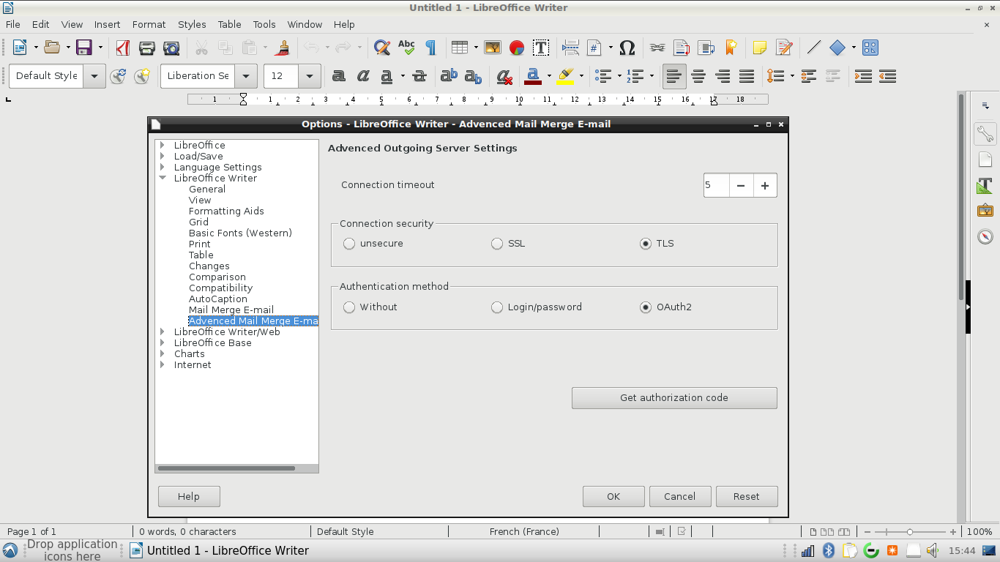

# gMailOOo v.0.0.4

## Google Mail OAuth2.0 implementation for LibreOffice.

The OAuth2.0 protocol allows the connection to the SMTP mail server of Google, after acceptance of the connection authorization, by exchange of tokens.

The revocation takes place in the management of: [Application associated with your account](https://myaccount.google.com/security?utm_source=OGB#connectedapps)

No more password is stored in LibreOffice.

## Has been tested with:
	
* LibreOffice 5.3.3.2 - Lubuntu 16.10 -  LxQt 0.11.0.3

* LibreOffice 5.3.1.2 x86 - Windows 7 SP1

I encourage you in case of problem to create an [issue](https://github.com/prrvchr/gContactOOo/issues/new)
I will try to solve it :-)
	
## Gmail account setting: 

* Smtp Server: smtp.gmail.com

* User: your gMail email address (mandatory)

* Password: your gMail password (needed for Login/password authentication, not used with OAuth2 but do not leave empty)

## Type of connection tested:

* SSL on port 465

* TLS on port 587 (recommanded connection type)

## Type of authentication tested:

* Login/password  with SSL or TLS

* OAuth2 with SSL or TLS (recommanded authentication type)

## Setting requirements for Login/password authentication with SSL or TLS:

Load: [Google Account Setting](https://myaccount.google.com/security?utm_source=OGB#connectedapps)

You must enable less secured application.

## Setting requirements for OAuth2 authentication with SSL or TLS:

You must get authorization code from Google:

LibreOffice - gMailOOo wants to Send email on your behalf for sending email

copy and paste authorization code to LibreOffice gMailOOo Message Box.
